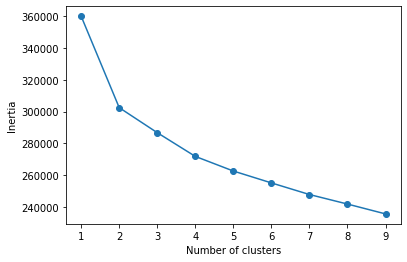
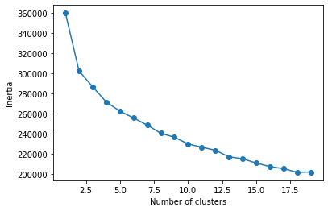
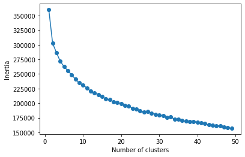
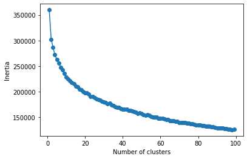

# ML assignment 3 
## Option Selection: 3

## Modifications to Original Code
### Count Vectorizer
Parameter changes were made to the count vectorizer to remove some noise from the descriptions. 
- Stop words were removed using the built in English Dictionary
- Words that are present in more than 90% of descriptions are removed
- ASCII accents are removed
- Non alphanumeric characters are removed using a regular expression found [here](https://stackoverflow.com/questions/51643427/how-to-make-tfidfvectorizer-only-learn-alphabetical-characters-as-part-of-the-vo)

All of these removals were done as i did not feel that clusering considering any of these features would be useful. 
```python
vectorizer = CountVectorizer(stop_words='english', token_pattern=r'(?u)\b[A-Za-z]+\b', max_df=0.9, strip_accents='ascii')
```

### Cluster Values & Elbow Plot
Sample code from Option 1 was taken and amended to allow a single value to be changed to test different levels of clusters. Elow plots were tested cluster sizes of 10,20,50 & 100.
The ```n_jobs=-1``` value was added to allow the calculation to use all processors to run faster.

```python
from sklearn.cluster import KMeans
clusterVal = 100
distortions = []
for i in range(1, clusterVal):
    km = KMeans(n_clusters=i,n_init=30,n_jobs=-1)
    km.fit(X)
    distortions.append(km.inertia_)
    
plt.plot(range(1, clusterVal), distortions, marker='o')
plt.xlabel('Number of clusters')
plt.ylabel('Inertia')
plt.show()
```

### Output & Sample Testing
To test the success of the clustering a nested loop was created to count the number of items in a custer and output a sample of the first 5 descriptions in the cluster.  

```python
sampleLen = 5

for x in range(0,clusterVal):
    count = 0
    sample = []
    
    for i in range(0,len(km.labels_)):
        if km.labels_[i] == x:
            count += 1
            if count < sampleLen:
                sample.append(raw_data['product_description'][i])
    
    print('**********')
    print('Cluster ' + str(x))
    print('Count ' + str(count))
    print('Sample of ' + str(sampleLen) + ' Descriptions\n')
    for i in range(0,len(sample)):
        print(sample[i] + '\n')
```

## Plots
### Cluster 10

### Cluster 20

### Cluster 50

### Cluster 100


## Cluster Selection
There appears to be a slight elbow that can be seen in many of the plots around 4 clusters. This was discounted as a viable option as i do not believe that creating so few clusters would be useful.
None of the different clustering plots show an extremely prominent elbow, but from looking at the elbow plot for 50 clusters there appears to be a slight flattering on the curve at around 20 clusters. Looking at the [sample](./cluster_20_sample.rtf) produced by running 20 clusters most of the clusers seem to be sensible, with grouping such as salad, frozen veg, and icecream.
